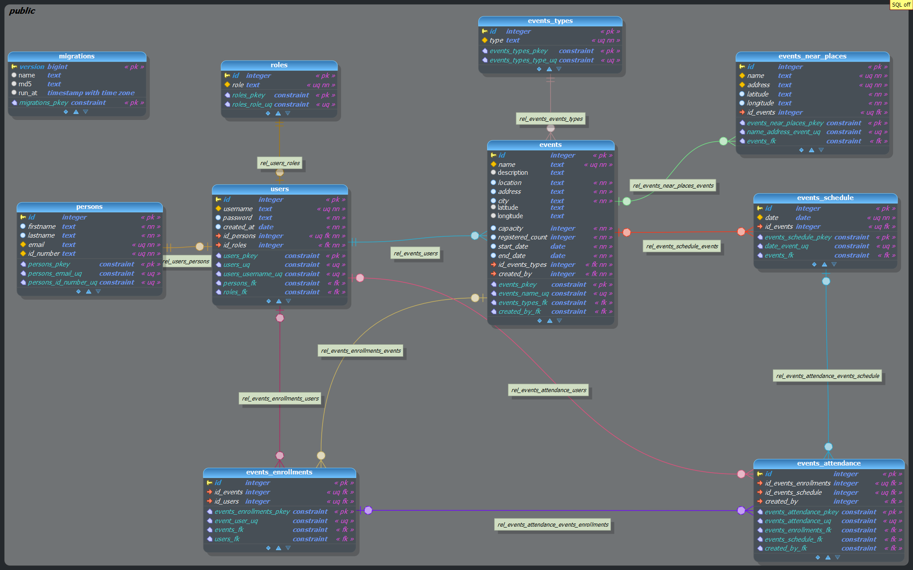

# **Event Manager APP**

# **Tabla de Contenido**
- [Consideraciones](#consideraciones)
- [Instalación y Ejecución](#instalación-y-ejecución)
  + [Configuración de variables](#configuración-de-variables)
  + [Ejecución](#ejecución)
- [Notas](#nota)
- [Recursos](#recursos)
  + [Video explicando la solución](#video-explicando-la-solución)
  + [Documentos](#documentos)
    - [Modelo ER]
    - [CI/CD - Arquitectura resiliente]


# **Consideraciones**
1. Entendiendo la solución:
  - Eventos: Cada evento tiene un rango de fecha específico (Inicio y Fin), dentro de este rango de fechas se configuran los días exactos de cuando se va a llevar a cabo una actividad del evento, esto quiere decir que para un Evento con un rango de fecha X-Y, existen N días dentro de ese rango que serán las fechas efectivas de ejecución del evento y a las cuáles se les registra asistencia.

  ```json
  {
    "name": "Evento 1",
    "description": "Breve resumen del evento.",
    "starDate": "Fecha de Inicio",
    "endData": "Fecha de Fin",
    "schedule": [
      {
        "date": "Día 1"
      },
      {
        "date": "Día 2"
      }
      // Todos los días del evento dentro del rango de la fecha de inicio.
    ]
    // Información adicional del evento
  }
  ```
  - Asistencias: Para poder registrar asistencias en el sistema el usuario interesado en el evento debe realizar previamente una inscripción a dicho evento, esta puede ser autogestionada o la puede realizar el usuario con rol de Administrador, seguidamente el usuario Administrador únicamente puede registrar la asistencia de cada inscripción al evento y a cada día de ejecución del evento.

  Las asistencias se realizan uno a uno consumiendo el API o masivamente subiendo un archivo en formato XLSX con los datos requeridos.


# **Instalación y Ejecución**

1.  Clone el repositorio

```bash
$ git clone https://github.com/jdager8/coordinadora_gestion_eventos.git
```

## **Configuración de variables**
2. Crear variables de entorno, las requeridas se encuentran el archivo .env.example

  - Tenga en cuenta que el servidor de base de datos soportado por la applicación es Postgres, dentro del archivo docker-compose se encontrarán valores por defecto, úselos o configúrelos a preferencia.

  - Crear archivo .env.production y configure las variables
  ```bash
        EM_DB_HOST= #Nombre de la Instancia del contenedor
        EM_DB_PORT= #Puerto dónde corre la BD
        EM_DB_USER= #Usuario
        EM_DB_PASSWORD= #Contraseña
        EM_DB_NAME= #Nombre de la base de datos
        EM_DB_DRIVER=pg
        EM_DB_SCHEMA=public
        EM_DB_MIGRATIONS_TABLE=migrations
        EM_DB_MIGRATIONS_FOLDER=migrations/*
        EM_JWT_SECRET= #Configure una clave para encriptar los tokens
        EM_JWT_EXPIRES_IN= #Tiempo de vida de JWT Token.
        EM_MAPBOX_API_URL=https://api.mapbox.com/geocoding/v5/mapbox.places/$1.json
        EM_MAPBOX_TOKEN= #Token de acceso de MapBox
        EM_MAPBOX_TYPES_LIMIT= #Límite de resultados de Mapbox configure máximo 10 (Valor permitido por Mapbox)
        EM_MAPBOX_RADIUS_LIMIT= #Radio en metros para filtrar resultados
        EM_MAPBOX_FILTER_TYPES=poi
        EM_FILE_SIZE_LIMIT=1000000
        EM_FILE_LIMIT=1
        EM_FILE_ALLOWED_EXTENSIONS=xls,xlsx
        EM_ATTENDANCE_TEMPLATE_FILE=attendance-template.xlsx
        EM_EVENT_TEMPLATE_FILE=event-template.xlsx
```

## **Ejecución**
  - Si todas las variables de entorno se encuentra correctamente configurados ejecute el siguiente comando.
```bash
$ docker-compose up -d
```
    Se crearan todos los contenedores necesarios para la ejecución de la aplicación y se ejecutarán las migraciones de la base de datos.

## **Nota**
Por defecto las migraciones crearan un usuario con el rol de administrador
```bash
http://localhost:8000/docs
```
Adicionalmente se provee archivo .json con la definición del API para pruebas en Postman.

```bash
/docs/em.postman_collection.json
```

## **Documentos**
- Modelo ER


- Video
```bash
/docs/em.postman_collection.json
```

- CI/CD - Arquitectura
```bash

```
